# Token Taxonomy Framework (TTF)

The Token Taxonomy Framework bridges the gap between blockchain developers, line of business executives and legal/regulators allowing them to work together to model existing and define new business models and networks based on Tokens.  The blockchain space alone makes it difficult to establish common ground, but when adding Tokens to the mix they find themselves speaking completely different languages.  The framework’s purpose IS:

- Educate – take a step back and CLEARLY define a token in non-technical and cross industry terms.  Using real world, everyday analogies so ANYONE can understand them using properties and behaviors to describe and define them.
- Define a common set of concepts and terms that can be used by business, technical and regulatory participants to speak the same language.
- Produce token definitions that have clear and understood requirements that are implementation neutral for developers to follow and standards to validate.
- Establish a base Token Classification Hierarchy (TCH) driven by metadata that is simple to understand and navigate for anyone interested in learning and discovering Tokens and underlying implementations.
- Tooling meta-data using the TTF syntax to be able to generate visual representations of classifications and modelling tools to view and create token definitions mapped to the taxonomy.
- Neutral to programming language and blockchain, distributed ledger or other distributed medium where tokens reside.
- Open and collaborative workshops to  accelerate the creation of powerful vertical industry applications and innovation for platforms, start-ups and enterprises.
- Standard artifacts and control message definitions mapped to the taxonomy that are implementation neutral and provide base components and controls that consortia, startups, platforms or regulators can use to work together.
- Encourage differentiation and vertical specialization while maintaining an interoperable base.
- Sandbox environment for legal and regulatory requirement discovery and input
- Used in taxonomy workshops for defining existing or new tokens which results in a contribution back to the framework to organically grow and expand across industries for maximum re-use.

It is **NOT**:

- Specific to the Ethereum family but applies to any shared medium.
- A Legal framework - but does establish common ground.
- A Regulatory framework - also creates common ground.
- Complete or comprehensive

This paper does not provide a backgrounder on Tokens and their function, but rather introduces taxonomy and classifications as a composition framework for creating or documenting existing token definitions.

See the [Token Hall](https://medium.com/tokenhall) for a backgrounder for business and technical audiences.

## Taxonomy

The taxonomy employs a composition framework that breaks tokens down into basic parts.  Base token types, properties and behaviors, which are then placed into a category by type and can support grouping.  Each decomposed part is documented in a taxonomy [artifact](taxonomy-file-format.md). Composing these token parts together also generates a taxonomy artifact defining a complete token referencing its component artifacts.

The taxonomy uses these terms for all tokens:

- Token Template - is a complete token definition that is used to create a token of the defined type. A template is able to create a clone of itself, which is a class.
- Token Class - is an deployed token from a defined template.
- Token Instance - a single token in a particular token class.

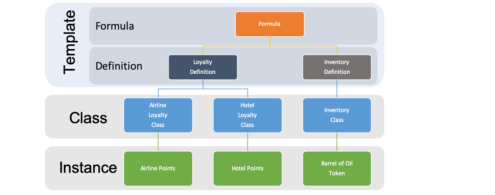

The taxonomy is anchored by single root token followed by two implementable or base types which provide the foundation for deriving specific tokens that differentiate themselves based on their behaviors and non-behavioral properties.

The root token is abstract, meaning you can't actually create one of them, and contains properties and a single behavior called constructable.  This behavior provides the ability for each token to have the ability to be a template, or to create a clone of itself.  Constructable simply means that every token will have a constructor control message when it is operating as a template and is defined in the token template artifact.  

The two base types can also be used together to create hybrid token definitions. Using the taxonomy, a token template is defined that is be used to create a token or asset class. The class is essentially a mold for creating instances (printing or minting) of that token type.  An instance of a token class is the smallest unit that can be owned in that class.

The taxonomy uses symbols to represent token bases and possible behaviors that are used to create a token definition as a formula.  The symbols and token formulas can be used to create hierarchical relationships useful for visualizations and to aid in learning and design.

## Base Tokens

### Fungible

Physical cash or a crypto currency is a good example of a fungible token. These tokens have interchangeable value with one another, where any quantity of them has the same value as another equal quantity as long as they are in the same class or series.

A fungible token is identified by **&tau;F**.

### Non-fungible

Every non-fungible token is unique. Hence a non-fungible token is not interchangeable with other tokens of the same type as they typically have different values.  A property title is a good example of a non-fungible token where the title to a broken-down shack is not of the same value as a mansion.

A fungible token is identified by **&tau;N**.

### Hybrids

#### Shared base with fungible classes

These tokens often share a common non-fungible parent or base token and then can have classes of fungible tokens that are possessed by owners.  An example of this hybrid is a rock concert, where the parent token represents the specific date or showing of the concert then a class for general admission and one for the "mosh pit".  General admission is fungible only in its class.

This hybrid **&tau;N(&tau;F)** is a non-fungible token (&tau;N) with a class(s) of fungible sub-tokens (&tau;F).

#### Fungible class owns many non-fungible (usually singletons)

A token can be the owner of another token or any number of tokens to represent the compound value of the underlying tokens.  For example, a **&tau;F**(&tau;N) has a fungible token class that is the owner one or more non-fungible tokens.

This would allow you to create a token that could be subdivided to allow each token to own a percentage of the pool of non-fungible tokens.  A mortgage backed security is a good example.

#### Fungible class owns many non-fungible and fungible classes

The rock concert example above could have an added "reserved" section where each seat is a non-fungible token.  Which would represent a **&tau;N**(&tau;F, &tau;N).

## Properties - Behavioral and Non-Behavioral Sets

Tokens usually have a common name, a symbol or unique identifier a quantity and an owner.  When you create a token, you are initially creating a token or asset class that represents the specific type of token that will represent instances of the token.

There are two types of properties, behavioral and non-behavioral.  Non-behavioral properties can be added to a token without effecting its behavior, like a serial number, reference properties or generic tags and do not fundamentally alter the token definition. However, behavioral properties fundamentally create a new token type.

For example, you can create the property title token that uses a base non-fungible token template and adds non-behavioral properties like a map number and plot location to be a fully functional token class.  You can repeat this process for an art token that uses the same base non-fungible token template and adds different non-behavioral properties need to represent it.  Even though these two token classes are based off the same template that are unique by their Name, Symbol and non-behavioral properties.

Behavioral properties are defined within their behavior artifact, non-behavioral properties are defined in a non-behavioral property set, or property set artifact. A property set artifact can contain the definition of a single or multiple non-behavioral properties like a `SKU` property.

Property sets have a **&phi;** prefix and a capital letter or acronym that is unique for the taxonomy. For example, **&phi;SKU** could be used for the `SKU` property set.

Non-behavioral properties are explicitly identified and will require property control messages to query or read and set the values that the property will hold.  The artifact definition for a property set should include these control message definitions.

Some base token properties may have different values or meaning depending on the context when evaluating them.  For example, the Owner property in the context of the token class refers to the creator or owner of the token class, which may come with permissions to mint or issue new tokens of the class but does not have permissions on any specific instance of the token class.  In the context of a token instance, Owner is the owner of that token instance and will have all the permissions that come with owning the token itself, like spending or transferring ownership of the token.

Token Templates start out with a common set of base properties and then diverge based on the behaviors the token will support and any non-behavioral property sets required.

## Behaviors

Behaviors can be capabilities or restrictions and can be common across fungible and non-fungible types, or only apply to one of them.  Behaviors also have supporting properties that become a part of the token schema and definition.  Behaviors use the first letter of the behavior as its representation in the taxonomy.  Collisions of letters are avoided by adding additional letters from a single word name or the letter of a second word.

Behaviors are very business specific and usually have existing “non-blockchain” implementations which are well understood. Here are some common behaviors.

### Common Behaviors

These are some common behaviors and not comprehensive.

Some of these behaviors are valid for either base type, while others only apply to one.  For example, *~t* or non-transferable would not make sense for a fungible token and subdividable does not apply to a token representing a *s* or singleton.

A behavior that is only valid for a specific type will include the *&tau;F* or *&tau;N* as a property such as *&tau;F{s}* and *&tau;N{~t}*.

Where hybrid tokens are being defined, behaviors can be defined that are common to all tokens, or at different granularities. For example, the following definition is for a fungible token that does not allow new tokens to be minted, which themselves are composed of non-fungible tokens that can be minted. However both classes of token are transferrable:

> **&tau;F{~m} (&tau;N{m}) {t}**

For Boolean behaviors like Sub-dividable *d* or Whole *~d* the absence of *~d* would imply *d*, but should usually be included for clarity if it is a restriction on a base property value like decimals or changing the owner.

Some behaviors, when applied, will effect other behaviors within the token definition.  These behaviors or traits can be thought of as inherited traits that will alter a particular behavior. An example of this is the behavior, delegable, which is the ability to delegate a behavior to another party to perform on your behalf as the owner.  Delegable is implied, so an absence of *~g* would imply that the token class or behavior is delegable.

delegable *g*

Behaviors like Transfer and Burn can be defined as delegable and when they are applied to a Token Template that is delegable, these behaviors will enable delegated invocations like TransferFrom and BurnFrom that allows an account the owner has approved to invoke these on their behalf.

Some behaviors will require setup at token class creation or construction.  A behavior that requires setup should have a Constructor control message that indicates how it should be setup at construction. For example, the behavior *r* Roles requires a role to be defined that is applied to a behavior(s) for a role check to be performed for authorization to invoke the behavior.

### Internal and External Behaviors

Behaviors can be internal or external depending on what the behavior effects.  An internal behavior is enabling or restricting properties on the token itself, where an external behavior is enabling or restricting the invocation of the behavior from an external actor.  For example, the behavior Sub-dividable means that the decimals property on the base token is > 0 and Non-transferable means that Owner property is not modifiable from the initial owner that was initially set when the token instance was created.  

An example of an external behavior would be something like Financeable or Encumberable.  This behavior would enable an external actor to invoke the behavior and the token would contain the correct properties to record the outcome of this behavior when invoked.  Meaning if a Loan contract where to invoke a FinanceRequest on a token instance the loan contract could expect a FinanceResponse back from the token as to the success or failure of this behavior.

The distinction between internal and external behaviors can seem like nuance at first but is an effective way to distinguish pure token behaviors from contract behaviors.  External behaviors are primarily contract behaviors, that need a supporting token interface to allow the two to be linked together and enable the entire behavior.  External behaviors will have two parts, contract and token,that are required when describing them.

## Token Control Messages

Interaction with a token and the properties of a token are described using simple message definitions.  The messages can represent token schema and state and also represent a `request/response` message pair for interacting with a token.  Some of these messages are a part of the base token while others come along with behaviors.

Some behaviors, like Transferable *t* are implicit for certain token bases.  A fungible token, for example, implicitly is Transferable so the taxonomy does not require it to be included for tooling or the definition but can be included for clarity: *&tau;F = &tau;F{t}*.

The combination of base and behavior messages are generically called `Control` messages for a Token Class and bundled in the token template. These messages are generic for the behavior and not specific to any particular blockchain or programming language. Control messages defined in a separate file using Protocol Buffer syntax representing the lowest level of implementation detail the framework provides.  For more detail on the specification definitions see [Token Control Messages](./token-control-messages.md).

## Behavior Groups

Behaviors are also grouped together to describe a common set of capabilities.  For example, Supply Control is a group made up of Mint-able, Burnable and Role Support for adding and removing supply and allowing certain accounts to be able to mint new tokens within the class.  
For example, an oil token may allow oil producers to mint new tokens as they introduce a barrel of oil into the supply chain. And the refiner can burn the token when it has been refined.

Behavior groups are represented in the taxonomy by a capital letter or acronym, *SC*, from their full name and equal to the symbols for the behaviors they include.
*SC = {m, b, r}*

## Taxonomy Artifact

Artifacts are primarily defined using a platform neutral model that provides type safety and strong schema validation as well as independence from the client display or interface.

Above, is a representation of the taxonomy model, where each property of the taxonomy is a list of available behaviors, behavior-groups, property-sets and templates.

Below is an example of a token template in the model showing the collection of artifacts in its definition:

- Base
- Behavior
- Behavior Groups
- Property Set
- Token Templates

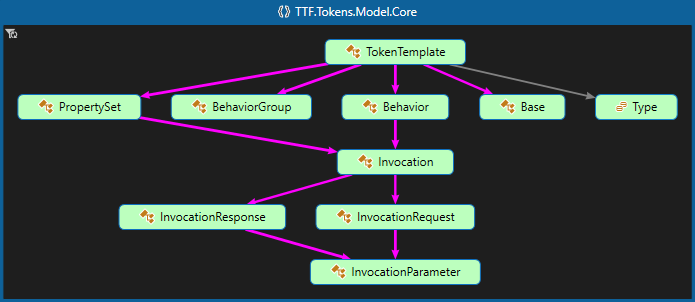

Written in protocol buffers, the schema supports a data structure to hold artifact definitions that anyone can understand what it does.  Storing the artifact definition in an object model allows for artifacts to be added or updated using any client interface or imported from files like Word or Google Docs.  The model serializes/saves to the artifact folder in JSON format so changes are tracked by GitHub.

An artifact is more than just a single JSON model file, but all the artifact's supporting documentation that can include protocol buffer control definitions, sequence diagrams, PowerPoint slides, etc.  All of an artifacts documents are contained within a single folder in the file structure based on the artifact type, token, behavior or behavior group.

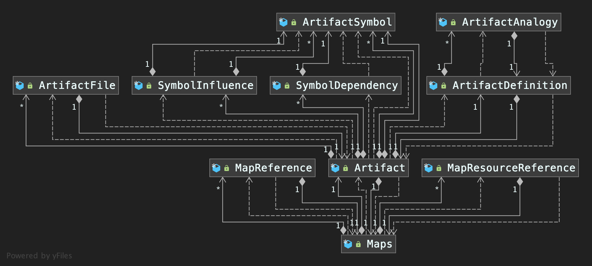

### Behavior Artifact

A behavior’s properties and control messages are packaged together in a behavior artifact.

A behavior may also include things like a sequence diagram to clearly define how a behavior is invoked and how the behavior responds using the defined control message definitions.

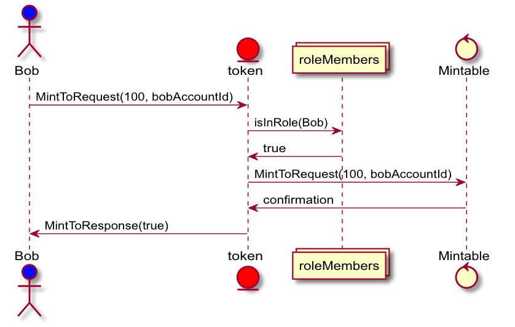

## Taxonomy Grammar

Grammar defines how to construct a token or behavior group as a formula that is recorded as metadata in the artifact for the respective token, behavior or group.
The grammar has a visual representation and one for tooling that does not include presentation characters for italics, Greek, super or subscript, etc.

Token definitions start with the token base type:

| Token Base Type | Visual Format | Tooling Format|
|:-------------:|:-------------:|:-------------:|
| Fungible      |  **&tau;F** | tF |
| Non-fungible  | **&tau;N**   |   tN |
| Hybrid – class in (,)|      |     |
| Non-fungible with a class of fungibles|**&tau;N(&tau;F)**      |    tN(tF) |
| Fungible with a class of non-fungibles| **&tau;F(&tau;N)**      |    tF(tN)|
| Fungible with a class of non-fungibles and fungibles| **&tau;F(&tau;N, &tau;F)** |   tF(tN,tF) |
| Non-fungible with a class of fungibles and non-fungibles| **&tau;N(&tau;F, &tau;N)**| tN(tF,tN) |
| etc.|      |     |

- Behavior is a single *italic* lower-case letter or letters that is unique.
- Behavior Group is an upper-case letter or letters that is unique with behavior formula encased in `{,}` Supply Control: `SC{m,b,r}`
- Property Sets are prefixed with **&phi;** followed by a upper case letter or acronym that is unique to the taxonomy. **&phi** is the visual format and `ph` is the tooling. If multiple sets are used they should be group using (,).
- Token Node is indicated surrounding the generic token formula in brackets `[]` and adds using `+` the unique non-behavioral properties, property sets, defined within them. i.e. **[&tau;N(&tau;F, &tau;N)+&phi;SKU]**

Whole Token Formulas start with the base token type, followed by a collection of behaviors and groups within {,}, ending in any property-sets.

Now we can begin naming and describing tokens starting with the base type followed by the behaviors or group of behaviors. A Token Artifact represents our complete token definition and is basically documenting its non-behavioral properties and then references to its base token type and a collection of references to these behaviors.

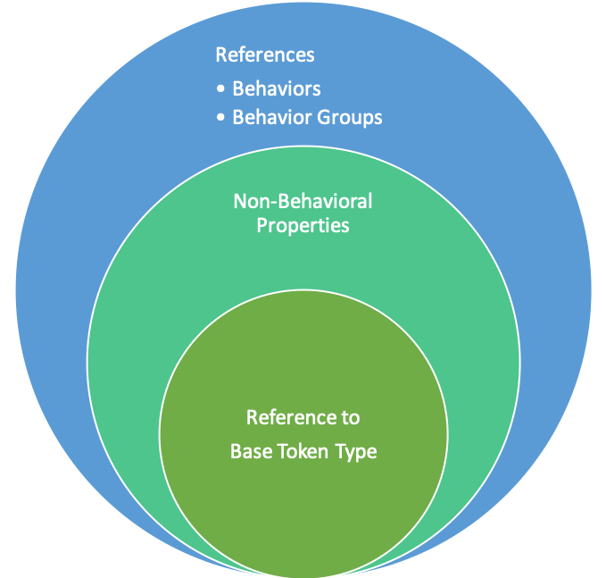

A token formula uses the taxonomy symbols, which are references to artifacts, can be used to represent a token that is useful for tooling allowing grouping and structures to be represented. Some examples:

A Token Formula is a Token Template, which is a collection of artifacts in a folder, where the artifact folder and the artifacts within start with an uppercase letter, i.e Loyalty. The template's artifacts have references to the artifacts of its constituent parts.

## Classification Hierarchy

Using the taxonomy, we can now start to construct basic hierarchical relationships creating a token tree structure.  Using the underlying taxonomy, tools can create visualizations for learning and comparing tokens and their implementations.  The tools become a great design services to define new tokens by composing them from the base token types and adding behavior artifacts and groups.

The root of the tree is a common base token or **&tau;** which has an owner Id, name, symbol, quantity and decimals property.

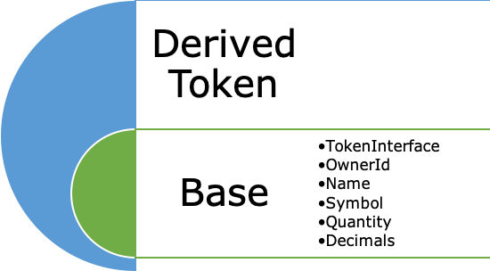

*TokenTaxonomyDefinition will be explained in the next section.*

There is also a base behavior artifact that includes simple GetTokenRequest/Response and GetTaxonomyRequest/Response.  

Then two branches for fungible *&tau;F* and non-fungible *&tau;N* and under them are branches for sub-dividable *d* and whole *~d* to create the first three relationships.  

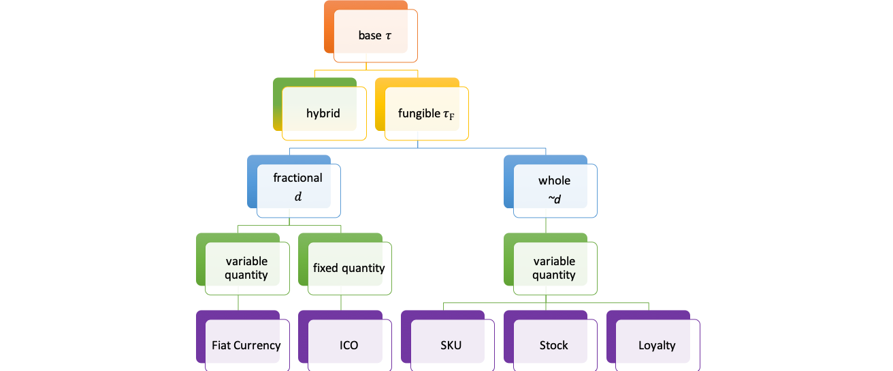

[Hybrid tokens](#hybrids) are not shown in the hierarchy, but there will be a design surface using the taxonomy to combine two tokens in a hybrid relationship.

From here the tree begins to get wider as behavior artifacts and behavior groups are added.  The tree visualization makes a good eye chart, but the token design surface becomes a powerful business tool.

When designing a token using the taxonomy, you will pick from one of these four lower branches of fungible (sub-dividable or whole) and non-fungible (sub-dividable or whole) and select it as a starting design surface.

Behavior artifacts and groups appear in lists like a menu that you can drag and drop inside your design surface to design a new token.  The taxonomy will block behaviors or behavior combinations that do not mix for the base token type you have selected.

Once completed, you will have defined a token that has a baseline set of properties and behavior messages to serve as a starting point for implementing a platform specific token.

## Taxonomy Workshops and Formulas

The taxonomy can be used in a workshop with stakeholders that want to define an existing or figure out a design for a new token.  This workshop starts by defining a high-level business and functional purpose for the token and then begin to decompose the existing implementation or if starting from scratch begin composing a taxonomy definition that matches the description.

In the workshop, the group will select a base token type and select from the existing behaviors in the taxonomy like choosing from A la Carte menu at a restaurant. If no suitable behavior or group can be found, the participants should create a new one.  Which means they will create a new taxonomy artifact using the artifact templates.

The end result of the workshop is to have a complete definition of the token that can be expressed using grammar as a formula.  This formula becomes the token's taxonomy definition like:

 >**&tau;F{~d,SC}**

When a workshops is completed, the artifacts should be recorded, any new behaviors, groups and token definitions and a pull request be issued for these to be merged after approval to be part of the framework and available for reuse by other workshops.

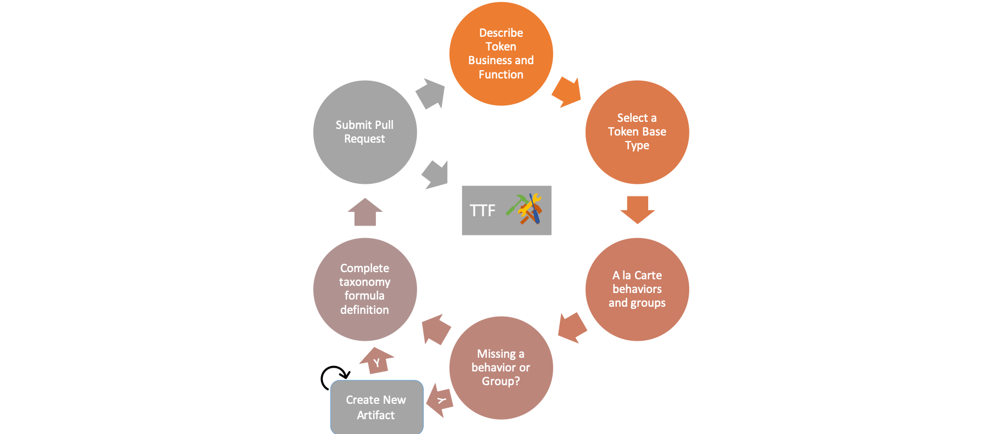

## Example Design

As an example, let’s see what a fungible token with supply control or &tau;F{<i>SC</i>} or for clarity &tau;F{<i>~d, SC</i>} could look like with a design tool.

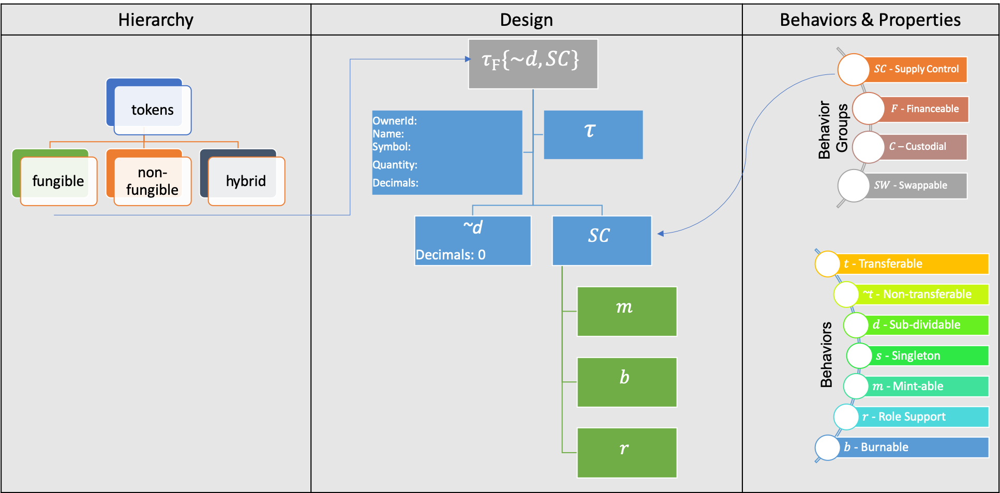

The designer would drag one of the bottom base tokens to start the process.  Then from the behavior palate, select *SC* from the Behavior Groups and drag it over, which brings over the properties *{m, b, r}* and additionally *~d* from Behaviors to design the token.

Contract designers can also attach contract logic to token behaviors and visually represent the relationships between a contract and its underlying tokens.

## Taxonomy Hierarchy

If you have created a token definition that is already defined, but your token has specific non-behavioral properties like a `SKU` or  `CUSIP` property you can create a new token definition for this formula in the taxonomy.

In this case the generic taxonomy definition: &tau;F{~d,SC} or `tF{~d,SC}` can be named `Whole Fungible Token with Supply Control` and represents a `branch` in the hierarchy and your token definition will be a `node` or `leaf` on the branch named `Inventory Item Token`.  Your new token equal to the generic branch formula plus the definition containing the `SKU` non-behavioral property i.e. [&tau;F{~d,SC}+&phi;SKU].

## Tooling and Taxonomy

Output from tooling or workshops produce taxonomy definitions as a formula.  This formula, using the tooling format instead of the visual format, maps to artifact metadata in the framework GitHub structure and can pull names, descriptions and control messages from the framework to create visualizations, populate user interfaces, generate reports and even generate code.

The GitHub artifact hierarchical file structure where artifact file names are the same as the name of the type described in it.  The parts in the file system are organized by folders, base, behaviors, behavior-groups and tokens.

- base - contains definitions for the base &tau and has a folder for fungible and non-fungible containing &tau;F and &tau;N.  Note the metadata in the artifacts uses the tooling format of tF and tN to prevent tools from escaping special characters like < and / used in the visual format.
- behaviors - folder for each behavior.
- behavior-groups - folder for each behavior group.
- property-sets - folder for each non-behavioral property set.
- tokens - complete token definitions contributed by workshops to the framework.

Tools can use the [Taxonomy Service](...) to navigate this structure and retrieve taxonomy data model to build experiences and generate control message libraries from the behavior protobuf files.

Other GitHub repositories can link to the taxonomy repository to link implementation specific code to specific taxonomy symbols like a behavior.  This code is then mapped as a platform specific implementation of that symbol.

For example, in the Ethereum community [OpenZeppelin](https://github.com/OpenZeppelin/openzeppelin-solidity) is a popular open source repository for Solidity source code for developers to use.  The behavior mintable or *m* could have a map to the code snip-it it their repo.  Code maps are defined in the taxonomy data model and are applied to the artifact.

Using a taxonomy code map, tools can be built to generate code for specific platforms by combining the code from the formula into new source composite source code to speed development.

Similarly, an implementation map can be used to provide navigation from a specific token formula like **&tau;F{~d,SC}** or `tF{~d,SC}` to map to a vendor or open source complete implementation in as open source or packaged solution.

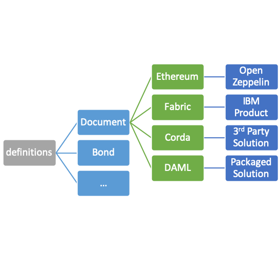

## Design Phases

Using the taxonomy when creating or defining an existing token can also generically apply to a token implementation as well. The high-level design phases are:

- Workshop - this is the initial phase when starting from scratch defining the token for your business needs. During this process you can create new taxonomy artifacts and when complete have a resulting token taxonomy definition which looks like a mathematical formula: **&tau;F{~d,SC}** or `tF{~d,SC}`
- Hierarchy Location - Once you have your taxonomy definition, you may be able to find an existing definition in the taxonomy with the same formula.  This doesn't mean that the token you defined is **exactly** the same as the existing definition. If your token definition has defined a non-behavioral property set or sets that are specific to your token, like a `phSKU` or  `phCU` you can create a new token definition for this formula in the taxonomy. See [Taxonomy Hierarchy](taxonomy-hierarchy).
- Implementation - You can use maps in the taxonomy to locate platform specific implementation code or complete token solutions from open source, vendors to get create or find an implementation suitable for your deployment platform target. i.e. Ethereum, Hyperledger Fabric, Corda or Digital Asset.

## Logical Interaction Models

Putting all of these taxonomy concepts together allows for interaction models to be modelled so anyone can understand how a completed token works.

- Creating a new Token (class) from a Template - sending a template its constructor message, which will return the new token class's unique identifier.
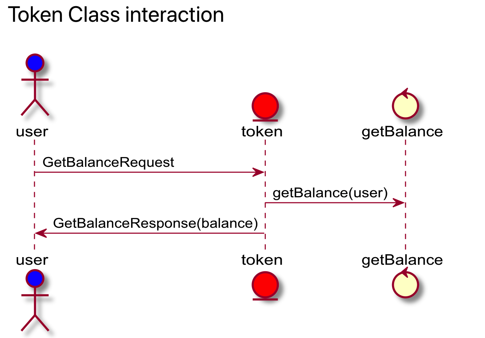

- Interacting with a Token (class) - send a behavior control command message to the token using its unique identifier.
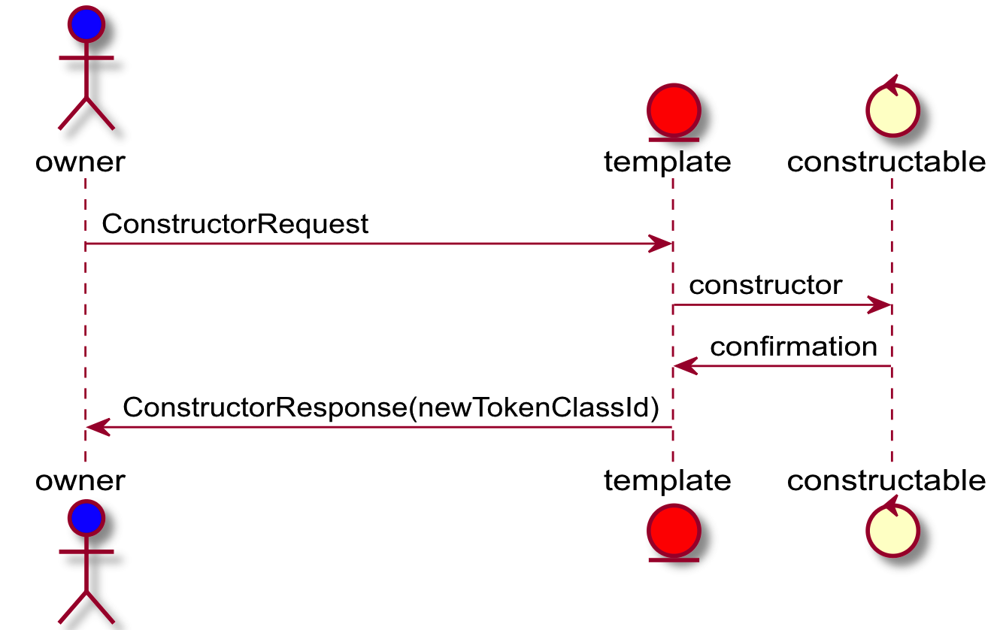

For each complete token definition these interactions can be defined as an artifact in the behavior folder.

[Interaction Models](logicalIM.md)

## Benefits of the framework

The behavior artifacts and groups are not fixed, nor do they represent complete implementation specific values. But they do represent a common base set of messages which similar to Ethereum's [ERC-20](https://eips.ethereum.org/EIPS/eip-20) standard allows for working with tokens in a generic way and supports implementation of specific properties and features without breaking the base messaging interface.

The `TokenTaxonomyDefinition` represents the token interface and contains the taxonomy identifiers for its root, behaviors and behavior groups it has, followed by any property-sets.

A `GetTaxonomyRequest` message sent to a token will respond with a `GetTaxonomyResponse` and be able to understand the token interface as well as any custom behaviors, internal or external, to begin interacting with it.

This allows for contracts to interact with tokens across blockchain implementations using the control messages defined for the behavior it intends to invoke.  The behavior properties can include meta data for recording cryptographic primitives to link contracts and tokens across consortium and platform boundaries.

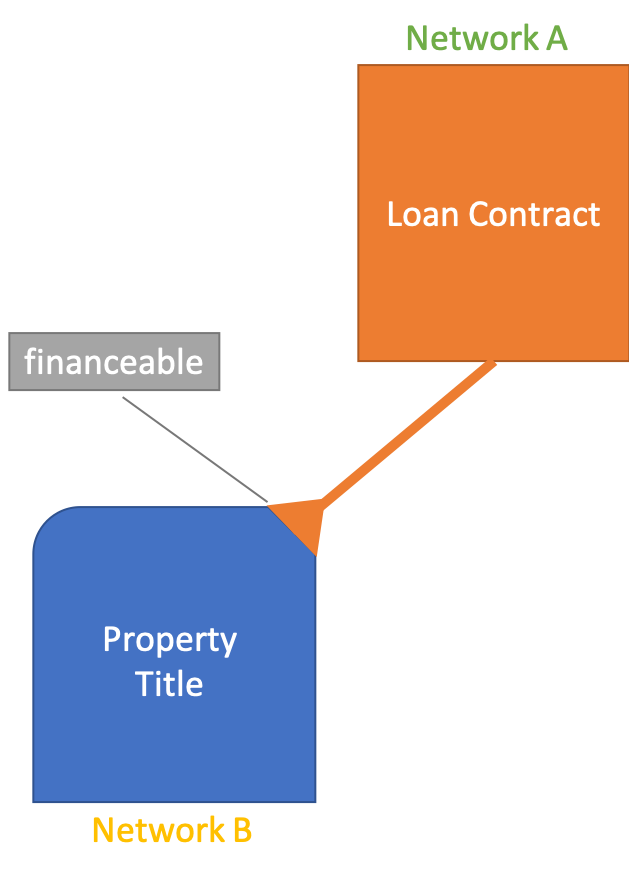

## Conclusion

The Token Taxonomy Framework is just the beginning of a cross platform and cross vertical industry collaborative effort to foster an increased understanding and use of tokens as well as drive standards for interoperability.  

The Token Taxonomy Initiative (TTI) will sponsor and help kick start the Special Interest groups for Financial Services, Insurance Healthcare, Energy, Real Estate, Telecommunications and Supply Chain to start defining the tokens most relevant and important for their industry.
