# Token Taxonomy Framework (TTF)

The Token Taxonomy Framework bridges the gap between blockchain developers, line of business executives and legal/regulators allowing them to work together to model existing and define new business models and networks based on Tokens.  The blockchain space alone makes it difficult to establish common ground, but when adding Tokens to the mix they find themselves speaking completely different languages.  The framework’s purpose IS:

- Educate – take a step back and CLEARLY define a token in non-technical and cross industry terms.  Using real world, everyday analogies so ANYONE can understand them using properties and behaviors to describe and define them.
- Define a common set of concepts and terms that can be used by business, technical and regulatory participants to speak the same language.
- Produce token definitions that have clear and understood requirements that are implementation neutral for developers to follow and standards to validate.
- Establish a base Token Classification Hierarchy (TCH) driven by metadata that is simple to understand and navigate for anyone interested in learning and discovering Tokens and underlying implementations.
- Tooling meta-data using the TTF syntax to be able to generate visual representations of classifications and modelling tools to view and create token definitions mapped to the taxonomy.
- Neutral to programming language and blockchain, distributed ledger or other distributed medium where tokens reside.
- Open and collaborative workshops to  accelerate the creation of powerful vertical industry applications and innovation for platforms, start-ups and enterprises.
- Standard artifacts and control message descriptions mapped to the taxonomy that are implementation neutral and provide base components and controls that consortia, startups, platforms or regulators can use to work together.
- Encourage differentiation and vertical specialization while maintaining an interoperable base.
- Sandbox environment for legal and regulatory requirement discovery and input
- Used in taxonomy workshops for defining existing or new tokens which results in a contribution back to the framework to organically grow and expand across industries for maximum re-use.

It is **NOT**:

- Specific to the Ethereum family but applies to any shared medium.
- A Legal framework - but does establish common ground.
- A Regulatory framework - also creates common ground.
- Complete or comprehensive

This paper does not provide a backgrounder on Tokens and their function, but rather introduces taxonomy and classifications as a composition framework for creating or documenting existing token definitions. However, it is worthwhile to establish so foundational definitions for two concepts, what a token is and what is often called a wallet or an account.

A token is a digital representation of some shared value. The value can be intrinsically digital with no external physical form or be a receipt or title for a material item or property. A purely digital token represents value directly, where the other references that actual value. For example, a crypto-currency like Bitcoin is intrinsically digital, it has no referenced physical form, but 1 kg of tokenized gold would.

An account or wallet (which can aggregate several accounts) represents a repository of tokens attributed to an owner. An owner is given an "address" which uniquely identifies the owner to which the owner possesses the key. A token's owner is a references to an address and a wallet is a reference to address for an owner. The wallet can provide a view into token balances in one place for the owner, much like a bank account or bank summary of accounts.

See the [Token Hall](https://medium.com/tokenhall) for a backgrounder for business and technical audiences.

## Common Terminology

The TTF is a composition framework that breaks tokens down into basic parts.  Base token types, properties and behaviors, which are then placed into a category by type and can support grouping.  Each decomposed part is documented in a taxonomy [artifact](taxonomy-file-format.md). Composing these token parts together also generates a taxonomy artifact defining a complete token referencing its component artifacts.

The taxonomy uses these terms for all tokens:

- Token Template - describes a token based on its type and what capabilities or restrictions a token created from the template would have. (i.e. Fractional Fungible Template). A template has two parts:
  - Template Formula - a set of reusable taxonomy components combined together used to classify and describe how a token would be worked with.
  - Template Definition - is derived from a formula, filling in the details to define a token that can be used to deploy as a class. (i.e. Crypto-currency Token Definition)
- Token Class - is an deployed token from a Template. (i.e. Bitcoin created from the crypto-currency template)
- Token Instance - a single token in a particular token class. (i.e. satoshi balance in your crypto-currency wallet)

### Template Formula and Definition

A formula is a complete list of taxonomy components used by a token that is paired with a definition that fills in the details. A template is like a cake recipe. A recipe has a list of ingredients and then details about the measurements of each ingredient, how to mix them together and long to bake.  

A template formula is like the list of ingredients and the definition is the instructions and details for defining a token template.

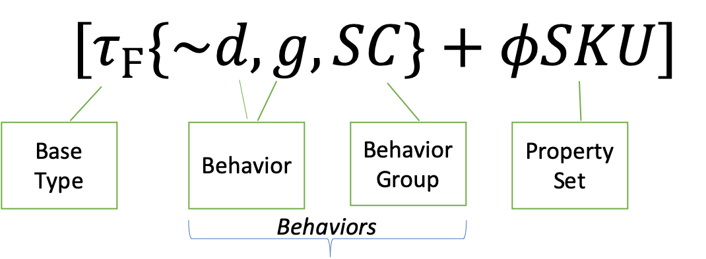

### Token Class vs. Instance

A token class is a deployed template using a specific implementation or platform, i.e. blockchain.  Depending on the target blockchain platform the implementation may be a complete set of source code or a software package from a 3rd party.

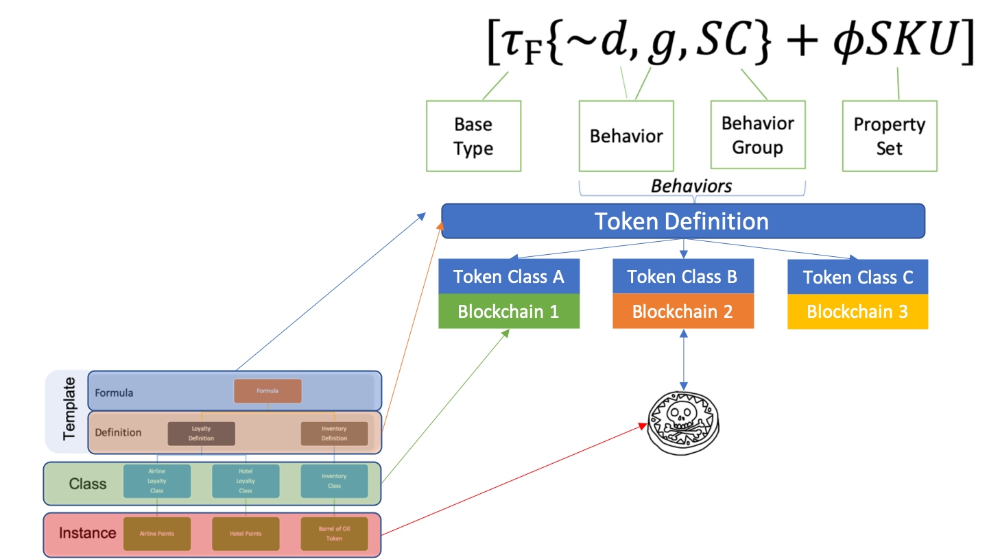

A token instance is an owned token of a particular class. Depending on the platform how this notion is actually implemented will vary. Instances of a token that you may own, or have in your digital wallet, represent your account balance of that token class.

### Taxonomy Artifacts, Categories & Templates

The taxonomy is comprised of artifacts that are categorized into 5 basic types:

- Base Types: the foundation of any token is its base token type.
- Behaviors: capabilities or restrictions that can apply to a token.
- Behavior-Groups: a bundle of behaviors that are frequently used together.
- Property-Sets: a defined property(s) that if applied a token can be queried against and support a value for.
- Token-Templates: a composition of other artifacts brought together to create a token template, classification and a detailed specification.

Artifacts themselves are just a set of files that share a common set of metadata and consistency for defining the artifact type. Artifacts are covered in more detail later in this document and in [taxonomy artifacts](taxonomy-artifact-format.md).

### Ingredients and Recipes

Suppose we were baking a cake, using a recipe. An artifact is like an ingredient that can be used in a recipe, i.e. milk, sugar, flour. The recipe pulls together the ingredients by specifying how much of each ingredient to add, when and how long to bake.

In this analogy, ingredients are Artifacts and a recipe is a Token Template.

### Artifact References and Templates

The TTF is comprised of artifacts, which is just a common way of defining items and compositions in the framework. To use an artifact you simply reference the artifact and apply overlay values for the artifacts in the template definition. Like the quantity of an ingredient in the cake recipe.  Just like a recipe has a list of ingredients followed by the details about the measurements, mixture and baking details, a template has a formula and a definition. When composing a Token Template, you are creating references to all of the Artifacts, ingredients, in a formula and then providing details about each of the ingredients in the definition.

An artifact is a verbose description of the TTF component it represents, which the TTF maintains a master copy. To use an artifact it is referenced, like a link or shortcut, that points to the full artifact.

When creating a Template Formula, it uses a template reference, which is only a pointer to the artifact with no other values or settings.

A Template Definition, created from a formula, uses an artifact it uses an artifact reference, which can contain values and settings specific for the artifact in the definition.

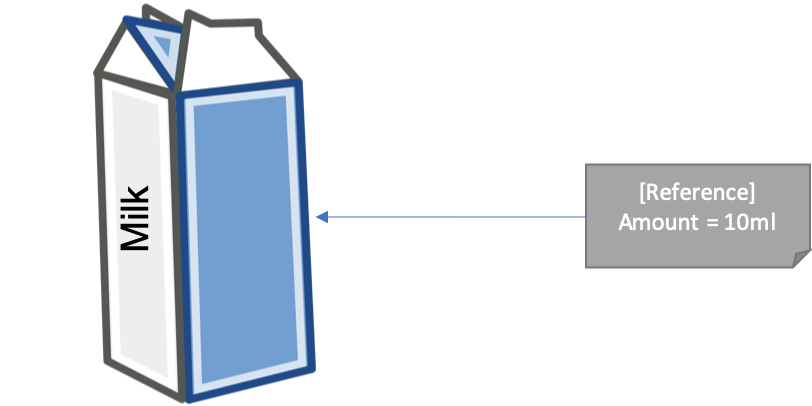

Using references in this way, prevents data duplication in the TTF and specification changes flow through existing Template artifacts without needing to be updated in each one.

### Classification

The TTF creates a hierarchy or tree of Templates where each Template is a branch. A branch can have branches and leafs, or nodes. The hierarchical tree is constructed starting with foundational classifications, like the roots of a tree and branches represented by Templates. Branches are connected to each other using references, described above, to create the hierarchical relationship structure. A leaf or node is an Definition based on a Template.

A Token Definition is a node on a branch/template, is a reference to the Template and the reference values to fill in the template's artifacts.

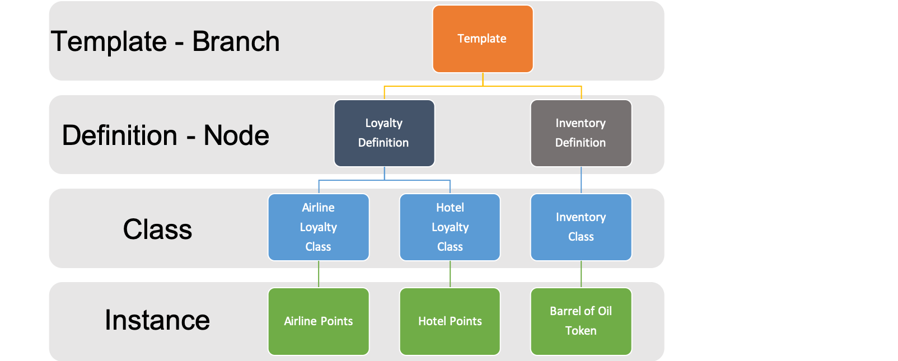

References are followed through the hierarchy and back to the Artifacts to validate and determine what instance values can be set in the instance.

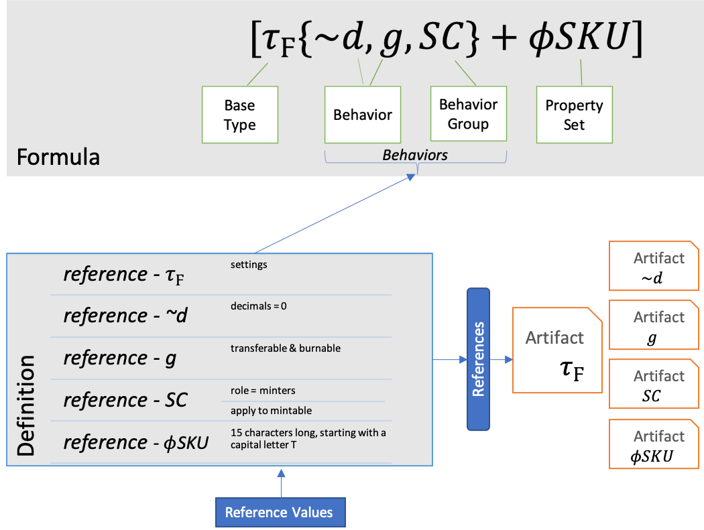

Classification is covered more deeply below.

### Control Messages

Behavior and Property-Sets contain `Control` message descriptions that are messages used to invoke a behavior or get/set the value of a property. These control messages are described in the artifact for the behavior or property-set. Control messages are named descriptively and come in request and response pairs. Control messages contain optional named parameters of a specific type for requests and responses.

These messages are generic for the behavior and not specific to any particular blockchain or programming language. Control messages defined in a separate file using Protocol Buffer syntax representing the lowest level of implementation detail the framework provides.  For more detail on the specification definitions see [Token Control Messages](./token-control-messages.md).

## Base Token Types

The taxonomy is anchored by single root token that is used to define properties shared by the two implementable or base token types. Properties like a common name, a symbol or unique identifier a quantity and an owner.  When you create a token, you are initially creating a token or asset class that represents the specific type of token that will represent instances of the token.

The root token also contains a single behavior called constructable.  This behavior provides tokens with the ability to be a template, or to create a clone of itself.  Constructable simply means that every token template will have a constructor control message to define initialization values when a clone of a template is created and is defined in the token template artifact.

The two base types can also be used together to create hybrid token definitions. Using the taxonomy, a token template is defined that is be used to create a token or asset class. The class is essentially a mold for creating instances (printing or minting) of that token type.  An instance of a token class is the smallest unit that can be owned in that class.

The taxonomy uses symbols to represent token bases and possible behaviors that are used to create a token definition as a formula.  The symbols and token formulas can be used to create hierarchical relationships useful for visualizations and to aid in learning and design.

### Fungible

Physical cash or a crypto currency is a good example of a fungible token. These tokens have interchangeable value with one another, where any quantity of them has the same value as another equal quantity as long as they are in the same class or series.

There are currently two kinds of fungible tokens, common, sometimes called account or balance tokens, and unique, or UTXO (unspent transaction output). This distinction might seem subtle, but is important when considering how fungible tokens can be traced and what properties they can have.

Common fungible tokens share a single set of properties, are not distinct from one another and balances are recorded in a central place. These tokens are simply represented as a balance or quantity attributed to an owners address where all the balances are recorded on the same balance sheet. This balance sheet is distributed, so its not 'centralized' but rather simplified. Common tokens have the advantage of easily sharing a common value like a "SKU" where the change in the value is immediately reflected for all tokens. Like money in a bank account is represented as a balance. Common tokens cannot be individually traced, only their balances between accounts can.

A common fungible token is identified by **&tau;F**.

Unique fungible tokens have their own identities and can be individually traced. Each unique token can carry unique properties that cannot be changed in one place and cascade to all and their balances must be summed. These are like bank notes, paper bills and metal coins, they are interchangeable but have unique properties like a serial number.

A unique fungible token is identified by **&tau;F'**.

### Non-fungible

Non-fungible token is unique. Hence a non-fungible token is not interchangeable with other tokens of the same type as they typically have different values.  A property title is a good example of a non-fungible token where the title to a broken-down shack is not of the same value as a mansion.

A fungible token is identified by **&tau;N**.

### Hybrids

#### Shared Non-fungible Parent with Fungible classes

These tokens often share a common non-fungible parent or base token and then can have classes of fungible tokens that are possessed by owners.  An example of this hybrid is a rock concert, where the parent token represents the specific date or showing of the concert then a class for general admission and one for the "mosh pit".  General admission is fungible only in its class.

This hybrid **&tau;N(&tau;F)** is a non-fungible token (&tau;N) with a class(s) of fungible sub-tokens (&tau;F).

#### Fungible Parent class owns or has many non-fungible Children (usually singletons)

A token can be the owner of another token or any number of tokens to represent the compound value of the underlying tokens.  For example, a **&tau;F**(&tau;N) has a fungible token class that is the owner one or more non-fungible tokens.

This would allow you to create a token that could be subdivided to allow each token to own a percentage of the pool of non-fungible tokens.  A mortgage backed security is a good example.

When a child token is declared a Singleton, by default it can contain one or more Singletons from the same template.

#### Fungible Parent Class owns or has many non-fungible and fungible child classes

The rock concert example above could have an added "reserved" section where each seat is a non-fungible token.  Which would represent a **&tau;N**(&tau;F, &tau;N).

### Token Classification

Tokens are classified in their template definitions using these characteristics:

- TokenType: Fungible or Non-Fungible
- TokenUnit: Fractional, Whole or Singleton (subdivision settings)
  - Fractional – you can make change like a $1 dollar bill can be broken into 4 .25¢ coins, but you cannot subdivide past 2 decimal places or have a .249999¢.
  - Whole – no subdivision allowed just whole numbers
  - Singleton – no subdivision and a quantity of 1
- RepresentationType: Intrinsic (pure digital value) or Reference (value located elsewhere)
  - Common tokens are balances on a single distributed ledger, tokens do not have individual identities. Like the balance in a checking account.
  - Unique tokens have their own identities, usually called an unspent transaction output or UTXO, that can have individual properties like a serial number.  Like physical money in your pocket, each bill has a unique serial number.
- ValueType: Common (balance or account) or Unique (UTXO)
  - Intrinsic value is where the digital token itself is valuable, a crypto currency
  - Reference value is where the token represents a physical item like a car or house, or ‘stored elsewhere’ digital item like a photo, scanned document or bank balance.
- TemplateType: Single or Hybrid
  - A hybrid token has a single parent token of a classification and can have many child tokens, that `belong` or are `controlled` by the parent. But like real children, hybrids can have unique abilities to model almost any business use case.
  - A single token does not have any children.

The TemplateType of the classification is set in the TemplateFormula and the others are set in the BaseToken. The classification is used to build the hierarchy and can also be used to pivot branches based on various settings. For simplicity, tokens are not separated based on their ValueType in the default view, but could be filtered by it.

## Properties

Properties of a token are used to define the information or data a token contains about itself and to record its activities.  Some properties are set when the token class is created from a template, like its name and owner while others are set and updated over a tokens lifetime.

A property contains some data value, how that data value is set indicates what type of property it is. If a property's value must be set or read by a behavior, it is called a behavioral property.  If a property can be set independent from any behavior it is called a non-behavioral property.

The difference in these two types is often sematic, but is key to understanding a property's overall scope. Perhaps the best way to determine if a property is behavioral or not is if its value can only be set or changed indirectly by an event triggered by a behavior.  A behavioral property may not have meaning or even be visible to observers outside of a token behavior.

A non-behavioral property should have its own "getter and setter" which means it will have controls for getting and setting its value directly.

- A Behavioral property value is not determined directly, but controlled by logic contained in a behavior. Setting its value is the result of calculation or logic based on an action in its controlling behavior. Visibility of its value may or may not be obtained directly from an explicit control message. A behavioral property does not define a control message to set the property's value.
- A Non-behavioral property's value is retrieved and set directly by its own [control messages](token-control-messages.md).

Non-behavioral properties can be added to a token without effecting its behavior, like a serial number, reference properties or generic tags and do not fundamentally alter the token definition. However, behavioral properties fundamentally create a new token type.

For example, you can create the property title token that uses a base non-fungible token template and adds non-behavioral properties like a map number and plot location to be a fully functional token class.  You can repeat this process for an art token that uses the same base non-fungible token template and adds different non-behavioral properties need to represent it.  Even though these two token classes are based off the same template that are unique by their Name, Symbol and non-behavioral properties.

Properties are defined in a property set. A property set artifact can contain the definition of a single or multiple properties like a `SKU` property.  A property set with multiple properties can represent a complex property like a `Customer` that contains properties like `First Name`, `Last Name`, `Address 1`, etc.

Property sets have a **&phi;** prefix and a capital letter or acronym that is unique for the taxonomy. For example, **&phi;SKU** could be used for the `SKU` property set. Adding a non-behavioral property set to a token template requires it to be specifically added to its formula.  Behavioral property sets are listed as a dependency for the behavior(s) that require them.

Non-behavioral properties are explicitly identified and will require property control messages to query or read and set the value the property will hold.  The artifact definition for a property set should include these control message definitions.

Some base token properties may have different values or meaning depending on the context when evaluating them.  For example, the Owner property in the context of the token class refers to the creator or owner of the token class, which may come with permissions to mint or issue new tokens of the class but does not have permissions on any specific instance of the token class.  In the context of a token instance, Owner is the owner of that token instance and will have all the permissions that come with owning the token itself, like spending or transferring ownership of the token.

Token Templates start out with a common set of base properties and then diverge based on the behaviors the token will support and any non-behavioral property sets required.

## Behaviors

Behaviors can be capabilities or restrictions, logic, and can be common across fungible and non-fungible types, or only apply to one of them.  Behaviors also have can supporting properties that become a part of the token schema and definition.  Behaviors use the first letter of the behavior as its representation in the taxonomy. Collisions of letters are avoided by adding additional letters from a single word name or the letter of a second word.

Behaviors are very business specific and usually have existing “non-blockchain” implementations which are well understood. Here are some common behaviors.

### Common Behaviors

These are some common behaviors and not comprehensive.

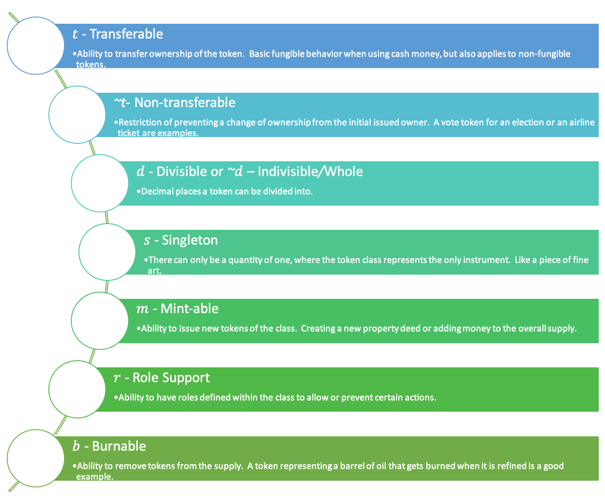

Some of these behaviors are valid for either base type, while others only apply to one.  For example, *~t* or non-transferable would not make sense for a fungible token and subdividable does not apply to a token representing a *s* or singleton.

A behavior that is only valid for a specific type will include the *&tau;F* or *&tau;N* as a property such as *&tau;F{s}* and *&tau;N{~t}*.

Where hybrid tokens are being defined, behaviors can be defined that are common to all tokens, or at different granularity's. For example, the following definition is for a fungible token that does not allow new tokens to be minted, which themselves are composed of non-fungible tokens that can be minted. However both classes of token are transferrable:

> **&tau;F{~m} (&tau;N{m}) {t}**

For Boolean behaviors like Sub-dividable *d* or Whole *~d* the absence of *~d* would imply *d*, but should usually be included for clarity if it is a restriction on a base property value like decimals or changing the owner.

### Special Behaviors and Interactions

Some behaviors, when applied, will effect other behaviors within the token definition.  These behaviors influence other behaviors that indicate they are influenced by the other behavior. An example of this is the behavior is delegable, which is the ability to delegate a behavior to another party to perform on your behalf as the owner.  Delegable is implied or the default, so an absence of *~g* the token class and any behaviors that are influenced by it behavior will be delegable.

delegable *g*

Behaviors like Transfer and Burn can be defined as delegable and when they are applied to a Token Template that is delegable, these behaviors will enable delegated invocations like TransferFrom and BurnFrom that allows an account the owner has approved to invoke these on their behalf.

Behaviors can be incompatible with each other and cause validation errors.  A behavior and its opposite `~` are obviously incompatible. A behavior will indicate what behaviors it will be incompatible with, for example if `Singleton`, *s* and `Mintable`, *m* are applied in the same token, validation will fail as a singleton can only have a quantity of 1 whole token.

Behaviors will also have dependencies on any property-sets required for their implementation.  For example, the behavior `Roles` has a dependency on the `role`, &phi;ROLE property-set to ensure that the underlying properties the behavior will need are present in the token definition.

Some behaviors will require setup at token class creation or construction.  A behavior that requires setup should have a Constructor control message that indicates how it should be setup at construction. For example, the behavior *r* Roles requires a role to be defined that is applied to a behavior(s) for a role check to be performed for authorization to invoke the behavior.

### Internal and External Behaviors

Behaviors can be internal or external depending on what the behavior effects. An internal behavior is enabling or restricting properties on the token itself, where an external behavior is enabling or restricting the invocation of the behavior from an external actor.  For example, the behavior Sub-dividable means that the decimals property on the base token is > 0 and Non-transferable means that Owner property is not modifiable from the initial owner that was initially set when the token instance was created.  

An example of an external behavior would be something like Financeable or Encumberable.  This behavior would enable an external actor to invoke the behavior and the token would contain the correct properties to record the outcome of this behavior when invoked.  Meaning if a Loan contract where to invoke a FinanceRequest on a token instance the loan contract could expect a FinanceResponse back from the token as to the success or failure of this behavior.

The distinction between internal and external behaviors can seem like nuance at first but is an effective way to distinguish pure token behaviors from contract behaviors.  External behaviors are primarily contract behaviors, that need a supporting token interface to allow the two to be linked together and enable the entire behavior.  External behaviors will have two parts, contract and token,that are required when describing them.

Some behaviors, like Transferable *t* are implicit for certain token bases.  A fungible token, for example, implicitly is Transferable so the taxonomy does not require it to be included for tooling or the template but can be included for clarity: *&tau;F = &tau;F{t}*.

## Behavior Groups

Behaviors are also grouped together to describe a common set of capabilities.  For example, Supply Control is a group made up of Mint-able, Burnable and Role Support for adding and removing supply and allowing certain accounts to be able to mint new tokens within the class.  
For example, an oil token may allow oil producers to mint new tokens as they introduce a barrel of oil into the supply chain. And the refiner can burn the token when it has been refined.

Behavior groups are represented in the taxonomy by a capital letter or acronym, *SC*, from their full name and equal to the symbols for the behaviors they include.
*SC = {m, b, r}*

## Template Formula

Template Formulas are where a token's components all comes together. Selecting artifacts from the previous categories, a template lists the artifacts that define what a token created from the template will be.

Starting with a base type, then collections of behaviors, groups and properties all of the ingredients are identified. Because artifacts themselves are described generically in isolation, when you include them in a template a formula is calculated and validated by the TTF to enforce grammar and rules.

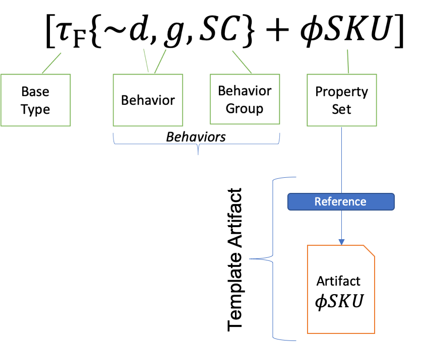

In the above example, we reference the artifact for the `phSKU` property.

## From Formula to Definition

Once you have created or identified an existing formula, you can use the TTF to create a Template Definition from it. The definition incorporates the artifacts identified in the formula as references, where the artifact being used is identified and the values and settings for the artifact are recorded. The definition has a link to its formula and the id for the definition becomes the unique identifier for the Token Template and Specification.

## Token Specification

The TTF creates a Token Specification dynamically from the Template Definition Id. The generation of the specification pulls the complete artifact for base, behaviors, property-sets and children into a specification and then merges the definition reference values for each artifact listed. This generates a full and quite verbose token specification that can be used as requirements for developers, documentation and training.
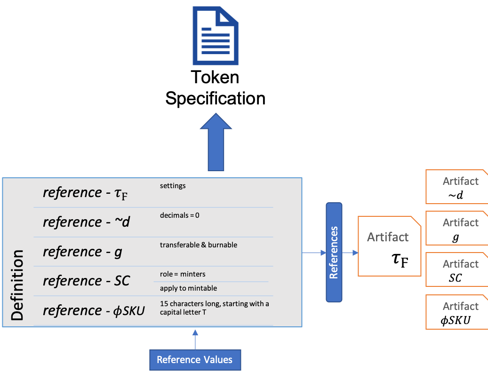

## Branch Classification

A Base token type provides the foundation of a template which additional artifacts are added to in order to complete the definition.  The base token for a template is either a `Single` or `Hybrid` with a token type of either `Fungible` or `Non-Fungible` and finally it units are classified as fractional, whole or singleton. Classification is primarily used for creating visualization hierarchies to compare templates and understand relationships between them.

By default Token Templates are organized in a simple hierarchy by Fungible, Non-Fungible and Hybrid. Further classification hierarchies can be dynamically generated like below.

## Taxonomy Model and Artifacts

Artifacts are primarily defined using a platform neutral model that provides type safety and strong schema validation as well as independence from the client display or interface.

> Note, the visualizations of the taxonomy model can be viewed as relational or an object model. The image below is using a relational view for simplicity. The Taxonomy model is an object model that is very much like a ORM (object to relational model) that is native to most platforms and can serialize to binary, JSON or Sql formats.

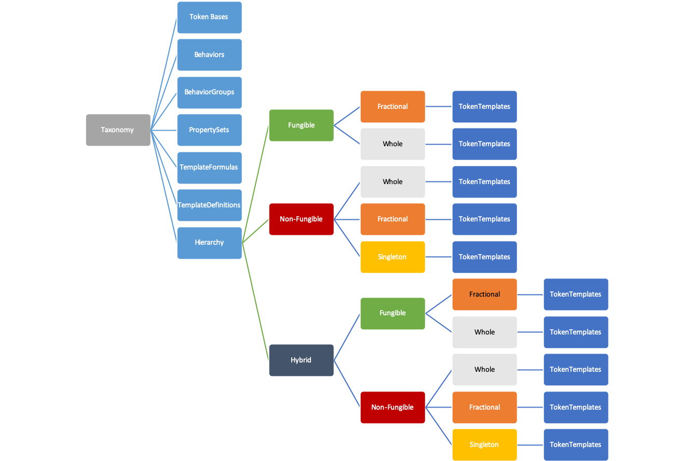

Above, is a representation of the taxonomy model, where each property of the taxonomy is a list of available behaviors, behavior-groups, property-sets, formulas, definitions,templates placed in a hierarchy.

Below is an example of a template formula in the model showing the collection of its artifacts:

- Base
- Behavior
- Behavior Groups
- Property Set

Written in protocol buffers, the schema supports a data structure to hold artifact definitions that anyone can understand.  Storing the artifact definition in an object model allows for artifacts to be added or updated using any client interface or imported from files like Word or Google Docs.  The model serializes/saves to the artifact folder in JSON format so changes are tracked by GitHub.

An artifact is more than just a single JSON model file, but all the artifact's supporting documentation that can include protocol buffer control definitions, sequence diagrams, PowerPoint slides, etc.  All of an artifacts documents are contained within a single folder in the file structure based on the artifact type, token, behavior or behavior group.

Artifacts are versioned as well, using a version folder and a version number defined in the ArtifactSymbol.  The most recent version, regardless of its number is stored in a folder called `latest` within the artifact folder name. Previous versions will be in version number folders, where each artifact file for that version is maintained.

An artifact is referenced by its ArtifactSymbol, which includes its version.  A reference that does not specify an Id will default to latest version.

For an in-depth technical overview of the model see [Taxonomy Model](taxonomy-model.md).

### Behavior Artifact

A behavior’s properties and control messages are packaged together in a behavior artifact.

A behavior may also include things like a sequence diagram to clearly define how a behavior is invoked and how the behavior responds using the defined control message definitions.

## Taxonomy Grammar

Grammar defines how to construct a token or behavior group as a formula that is recorded as metadata in the artifact for the respective token, behavior or group.
The grammar has a visual representation and one for tooling that does not include presentation characters for italics,Greek, super or subscript, etc. Using the grammar, a Token Formula can be written to have a shorthand definition for the template used in classifying the token.

The formula uses brackets, braces and parentheses to combine the token parts.

Token definitions start with the token base type:

| Token Base Type | Visual Format | Tooling Format|
|:-------------:|:-------------:|:-------------:|
| Fungible      |  **&tau;F** | tF |
| Non-fungible  | **&tau;N**   |   tN |
| Unique Fungible      |  **&tau;F'** | tF' |
| Unique Non-fungible  | **&tau;N'**   |   tN' |
| Hybrid – class in (,)|      |     |
| Non-fungible with a class of fungibles|[&tau;N] (&tau;F)      |   `[tN](tF)` |
| Fungible with a class of non-fungibles| [&tau;F] (&tau;N)      |    `[tF](tN)`|
| Fungible with a class of non-fungibles and fungibles| [&tau;F](&tau;N, &tau;F) |   `[tF](tN,tF)` |
| Non-fungible with a class of fungibles and non-fungibles| [&tau;N](&tau;F, &tau;N)| `[tN](tF,tN)` |
| Non-fungible with a class of fungibles and non-fungibles, with each child having formulas| [&tau;N]([&tau;F], [&tau;N)]| `[tN]([tF],[tN])` |
| etc.|      |     |

- Behavior is a single *italic* lower-case letter or letters that is unique.
- Behavior Group is an upper-case letter or letters that is unique with behavior formula encased in `{,}` Supply Control: `SC{m,b,r}`
- Property Sets are prefixed with **&phi;** followed by a upper case letter or acronym that is unique to the taxonomy. **&phi** is the visual format and `ph` is the tooling. to add a property set to a template, enclose the token definition within [] adding the property set after the behaviors with a + for each set needed. All of the token's behaviors and properties are contained within the surrounding brackets [].
- For example, a Token Branch can be a Formula with just the base and behaviors and can then have a Node that had the Branch formula surround by brackets `[]` and adds using `+` the unique property sets, added within the brackets. i.e. **[&tau;N(&tau;F, &tau;N)+&phi;SKU]**
- Hybrid tokens, represented as children of a base parent are added after the base's [] and contained with in parenthesis (,).  These child tokens are also contained within brackets resulting in a formula grouping like: ``
- For hybrid tokens, you can apply behaviors to the entire hybrid definition by ending the formula with a list of behaviors in {,}.
- Hybrid children with formulas are grouped within the formula's[]: i.e. **[&tau;N{s,~t}(&tau;F{~d,SC}]**

Whole Token Formulas start with the base token type, followed by a collection of behaviors and groups within {,}, ending in any property-sets.

A token formula uses the taxonomy symbols, which are references to artifacts, can be used to represent a token that is useful for tooling allowing grouping and structures to be represented. Some examples:

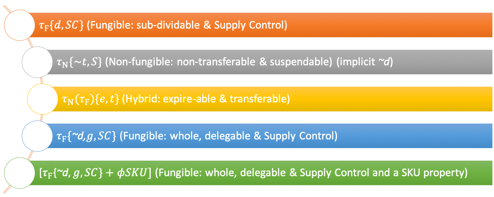

A Token Formula is a Token Template, which is a collection of artifacts start with an uppercase letter, i.e Loyalty. The template's artifacts have references to the artifacts of its constituent parts.

Now we can begin naming and describing tokens starting with the base type followed by the behaviors or group of behaviors. A Token Definition represents our complete token and is basically documenting everything a developer would need to know in order to develop an implementation.

A template can have multiple definitions, for example a Fractional Fungible template may `hard code` a number of decimal places for subdivision, while another allows that to be a deployment decision.

## Classification Hierarchy

Using the taxonomy, we can now start to construct basic hierarchical relationships creating a token tree structure.  Using the underlying taxonomy, tools can create visualizations for learning and comparing tokens and their implementations.  The tools become a great design services to define new tokens by composing them from the base token types and adding behavior artifacts and groups.
The root of the tree is a common base token or **&tau;** which has an owner Id, name, quantity and decimals property.

*TokenTaxonomyDefinition will be explained in the next section.*

There is also a base behavior artifact that includes simple GetTokenRequest/Response and GetTaxonomyRequest/Response.  

There three branches used to classify templates:

- Fungible - common and unique
- Non-Fungible - common and unique
- Hybrid *&tau;F(&tau;)*, *&tau;N(&tau;)*, etc.
  - Has Fungible and Non-Fungible branches for hybrids by parent.

Dynamic branches can be created using the TOM like:

- Fractional Fungible (sub-dividable) *&tau;F{d}* 
- Fractional Non-Fungible (sub-dividable) *&tau;N{d}*
- Whole Fungible (non-sub-dividable) *&tau;F{~d}*
- Whole Non-Fungible (non-sub-dividable) *&tau;N{~d}*
- Singleton *&tau;N{s}* (s implies ~d)
  

[Hybrid tokens](#hybrids) can reference another branch within the tree to prevent duplication.

Branches on the tree begin to get wider as behavior artifacts and behavior groups are added.  The tree visualization makes a good eye chart, but the token design surface becomes a powerful business tool.

### Example Design

As an example, let’s see what a fungible token with supply control or &tau;F{<i>SC</i>} or for clarity &tau;F{<i>~d, SC</i>} could look like with a design tool.

When designing a token using the taxonomy, you will pick from one of these six lower branches of fungible (fractional or whole) and non-fungible (fractional, whole or singleton) or hybrid as a starting design surface.

Behavior artifacts and properties appear in lists like menu palets you can drag and drop inside your design surface to design a new token.  The taxonomy will block behaviors or behavior combinations that do not mix for the base token type you have selected.

Once completed, you will have defined a token that has a baseline set of properties and behavior messages to serve as a starting point for implementing a platform specific token.

## Taxonomy Hierarchy

If you have find a token template that is already defined, but your token has specific non-behavioral properties like a `SKU` or  `CUSIP` property you can create a new token template, reference the existing template and add your properties to create a new template and branch in the taxonomy.

In this case the generic taxonomy definition: &tau;F{~d,SC} or `tF{~d,SC}` can be named `Whole Fungible Token with Supply Control` and represents a `branch` off the `Whole Fungible branch` in the hierarchy.

The template token definition adding the SKU property-set will be a `branch` off this branch named `Inventory Item Template`.  Your new token template reuses the templates above adding the `SKU` non-behavioral property to the formula i.e. [&tau;F{~d,SC}+&phi;SKU].

## Tooling and Taxonomy

Output from tooling or workshops produce taxonomy definitions as a formula.  This formula, using the tooling format instead of the visual format, maps to artifact metadata in the framework GitHub structure and can pull names, descriptions and control messages from the framework to create visualizations, populate user interfaces, generate reports and even generate code.

The GitHub artifact hierarchical file structure where artifact file names are the same as the name of the type described in it.  The parts in the file system are organized by folders, base, behaviors, behavior-groups and token-templates.

- base - contains definitions for the base &tau and has a folder for fungible and non-fungible containing &tau;F and &tau;N.  Note the metadata in the artifacts uses the tooling format of tF and tN to prevent tools from escaping special characters like < and / used in the visual format.
- behaviors - folder for each behavior.
- behavior-groups - folder for each behavior group.
- property-sets - folder for each non-behavioral property set.
- token-templates - token templates contributed by workshops to the framework.
 - formulas - complete token formula that is the foundation for a template definition.
 - definitions - complete token definition that is based off a formula.
 - specifications - the generated token specification from the template definition.

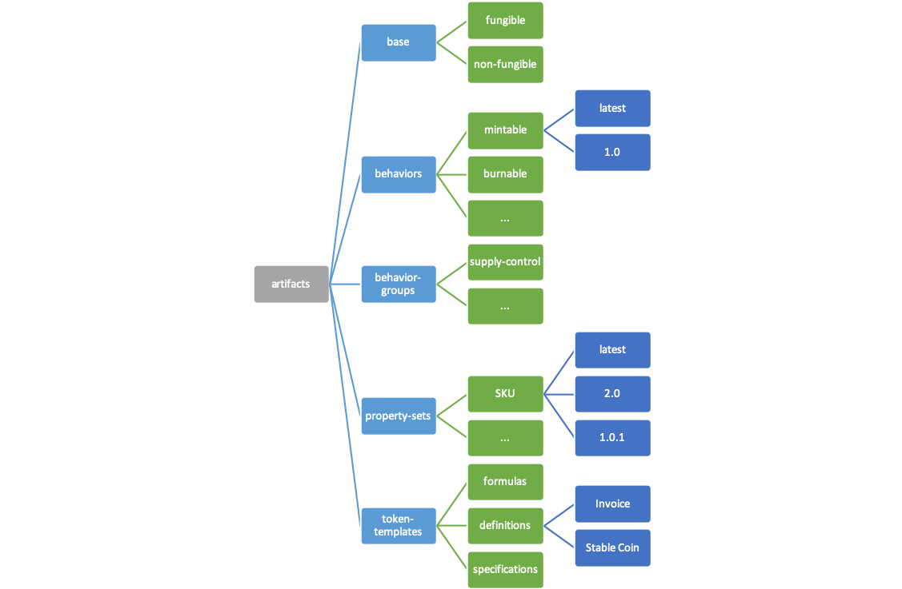

Tools can use the [Taxonomy Service](...) to navigate this structure and retrieve taxonomy data model to build experiences and generate control message libraries from the behavior protobuf files.

Other GitHub repositories can link to the taxonomy repository to link implementation specific code to specific taxonomy symbols like a behavior.  This code is then mapped as a platform specific implementation of that symbol.

For example, in the Ethereum community [OpenZeppelin](https://github.com/OpenZeppelin/openzeppelin-solidity) is a popular open source repository for Solidity source code for developers to use.  The behavior mintable or *m* could have a map to the code snip-it it their repo.  Code maps are defined in the taxonomy data model and are applied to the artifact.

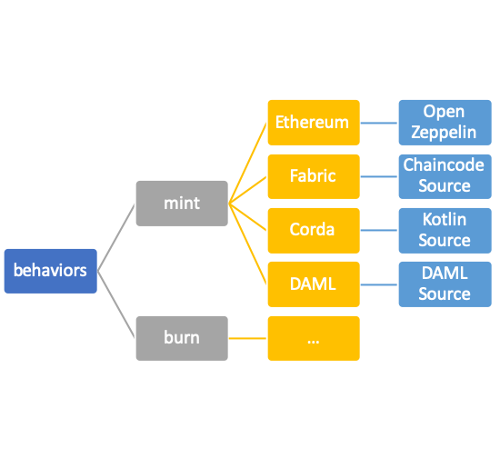

Using a taxonomy code map, tools can be built to generate code for specific platforms by combining the code from the formula into new source composite source code to speed development.

Similarly, an implementation map can be used to provide navigation from a specific token formula like **&tau;F{~d,SC}** or `tF{~d,SC}` to map to a vendor or open source complete implementation in as open source or packaged solution.

## Design Phases

Using the taxonomy when creating or defining an existing token can also generically apply to a token implementation as well. The high-level design phases are:

- Workshop - this is the initial phase when starting from scratch defining the token for your business needs. During this process you can create new taxonomy artifacts and when complete have a resulting token taxonomy definition which looks like a mathematical formula: **&tau;F{~d,SC}** or `tF{~d,SC}`
- Hierarchy Location - Once you have your taxonomy definition, you may be able to find an existing definition in the taxonomy with the same formula.  This doesn't mean that the token you defined is **exactly** the same as the existing definition. If your token definition has defined a non-behavioral property set or sets that are specific to your token, like a `phSKU` or  `phCU` you can create a new token definition for this formula in the taxonomy. See [Taxonomy Hierarchy](taxonomy-hierarchy).
- Implementation - You can use maps in the taxonomy to locate platform specific implementation code or complete token solutions from open source, vendors to get create or find an implementation suitable for your deployment platform target. i.e. Ethereum, Hyperledger Fabric, Corda or Digital Asset.

## Logical Interaction Models

Putting all of these taxonomy concepts together allows for interaction models to be modelled so anyone can understand how a completed token works.

- Creating a new Token (class) from a Template - sending a template its constructor message, which will return the new token class's unique identifier.

- Interacting with a Token (class) - send a behavior control command message to the token using its unique identifier.

For each complete token definition these interactions can be defined as an artifact in the behavior folder.

[Interaction Models](logicalIM.md)

## Taxonomy Workshops and Formulas

The taxonomy can be used in a workshop with stakeholders that want to define an existing or figure out a design for a new token.  This workshop starts by defining a high-level business and functional purpose for the token and then begin to decompose the existing implementation or if starting from scratch begin composing a taxonomy definition that matches the description.

In the workshop, the group will select a base token type and select from the existing behaviors in the taxonomy like choosing from A la Carte menu at a restaurant. If no suitable behavior or group can be found, the participants should create a new one.  Which means they will create a new taxonomy artifact using the TTF.

The end result of the workshop is to have a complete specification for the token that can be expressed using grammar as a formula and its definition.  This formula becomes a TTF Branch:

 >**&tau;F{~d,SC}**

Using the formula, a template definition is created filling in the details about the token.  These two artifacts define a Token Template. Also, from the definition a Token Specification can be generated upon request, which is handy for documentation or business validation.

When a workshops is completed, the artifacts should be recorded, any new behaviors, groups, properties and token templates and a pull request be issued for these to be merged after approval to be part of the framework and available for reuse by other workshops.

## Benefits of the framework

The behavior artifacts and groups are not fixed, nor do they represent complete implementation specific values. But they do represent a common base set of messages which similar to Ethereum's [ERC-20](https://eips.ethereum.org/EIPS/eip-20) standard allows for working with tokens in a generic way and supports implementation of specific properties and features without breaking the base messaging interface.

The `TokenTaxonomyDefinition` represents the token interface and contains the taxonomy identifiers for its root, behaviors and behavior groups it has, followed by any property-sets.

A `GetTaxonomyRequest` message sent to a token will respond with a `GetTaxonomyResponse` and be able to understand the token interface as well as any custom behaviors, internal or external, to begin interacting with it.

This allows for contracts to interact with tokens across blockchain implementations using the control messages defined for the behavior it intends to invoke.  The behavior properties can include meta data for recording cryptographic primitives to link contracts and tokens across consortium and platform boundaries.

## TTF Extensions

Where does the TTF end and implementation begin? Using an artifact's `Map` you can reference:

- Complete source code for a platform and language (i.e. HLF/Chaincode/Go - > url)
- A finished solution or implementation (i.e. a link to a website or marketplace offering)
- Regulatory guidance (i.e. link to a regulatory agency report)

This can be done for an individual behavior to have a mapping to a `code snippit` or to a Template Definition for complete source code or reference a finished solution.

## Conclusion

The Token Taxonomy Framework is just the beginning of a cross platform and cross vertical industry collaborative effort to foster an increased understanding and use of tokens as well as drive standards for interoperability.  

The Token Taxonomy Initiative (TTI) will sponsor and help kick start the Special Interest groups for Financial Services, Insurance Healthcare, Energy, Real Estate, Telecommunications and Supply Chain to start defining the tokens most relevant and important for their industry.
